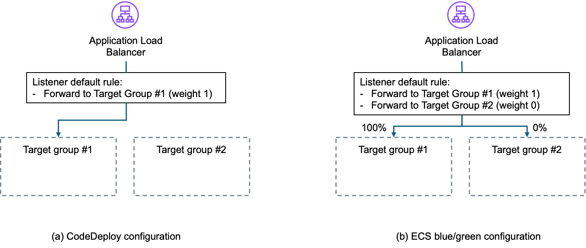
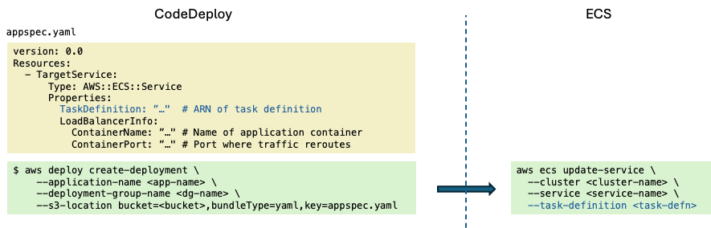
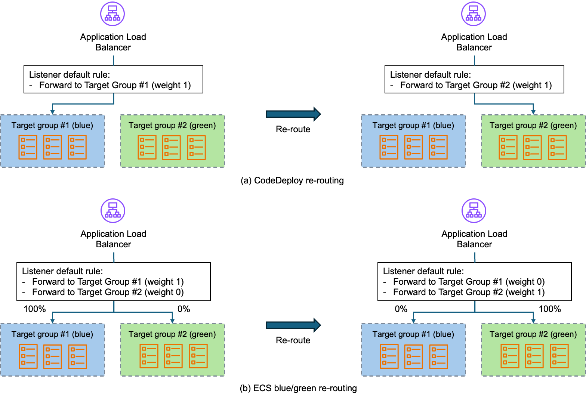
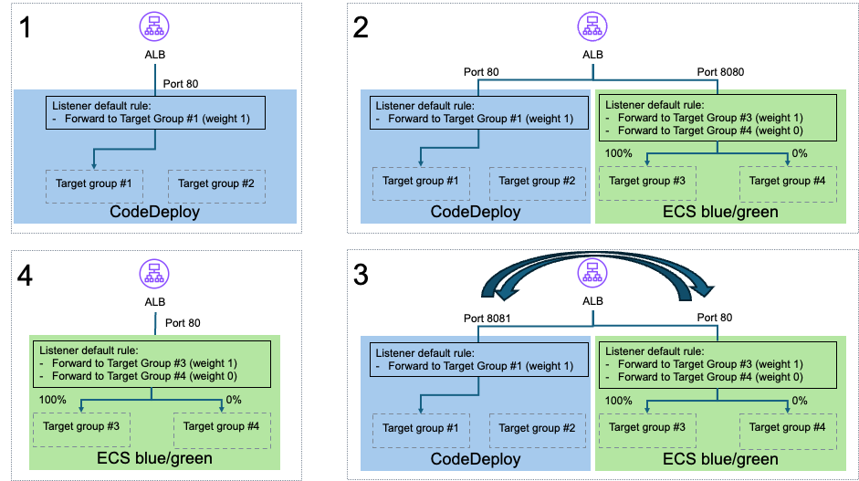
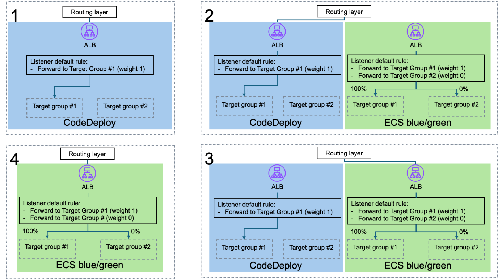

{}
⚠️ **Note:** The information below is for reference purposes only. Please **do not copy verbatim** for your report, including this warning.
{}

# Migrating from AWS CodeDeploy to Amazon ECS for blue/green deployments

by Mike Rizzo, Islam Mahgoub, and Olly Pomeroy on 16 SEP 2025 in [Amazon Elastic Container Service](https://aws.amazon.com/blogs/containers/category/compute/amazon-elastic-container-service/), [AWS CodeDeploy](https://aws.amazon.com/blogs/containers/category/developer-tools/aws-codedeploy/), [Best Practices](https://aws.amazon.com/blogs/containers/category/post-types/best-practices/), [Developer Tools](https://aws.amazon.com/blogs/containers/category/developer-tools/), [DevOps](https://aws.amazon.com/blogs/containers/category/devops/), [Technical How-to](https://aws.amazon.com/blogs/containers/category/post-types/technical-how-to/) [Permalink](https://aws.amazon.com/blogs/containers/migrating-from-aws-codedeploy-to-amazon-ecs-for-blue-green-deployments/) [Share](https://aws.amazon.com/vi/blogs/containers/migrating-from-aws-codedeploy-to-amazon-ecs-for-blue-green-deployments/#)

---
With blue/green deployments, you can release new software by shifting traffic between two identical environments that are running different versions of an application. This mitigates common risks associated with deploying new software releases, by facilitating the safe testing of new deployments and providing a rollback capability with near-zero downtime.

Until recently, [<u>Amazon Elastic Container Service</u>](https://aws.amazon.com/ecs/) (Amazon ECS) only supported rolling updates as a native deployment strategy, and you needed to use [<u>AWS CodeDeploy</u>](https://aws.amazon.com/codedeploy/) if you wanted to implement blue/green deployments. This has changed with the recent launch of [<u>ECS blue/green deployments</u>](https://aws.amazon.com/blogs/aws/accelerate-safe-software-releases-with-new-built-in-blue-green-deployments-in-amazon-ecs/).

ECS blue/green deployments offer similar functionality to CodeDeploy, but there are some differences in the features available and their implementation. This post is targeted at organizations that currently use CodeDeploy for blue/green deployments on Amazon ECS, and that are considering a migration to the new Amazon ECS capability. It provides guidance on (1) factors to consider when planning your migration, (2) mapping CodeDeploy concepts to their equivalent in ECS blue/green deployments, and (3) migration strategies.

## **Planning your migration**

When migrating from CodeDeploy to ECS blue/green deployments, you should consider the following points as part of your planning process:

-   New possibilities: ECS blue/green deployments enable a number of use cases that are not supported with CodeDeploy. These include the following:

    -   Service discovery options: CodeDeploy only supports services fronted by [<u>Elastic Load Balancing</u>](https://aws.amazon.com/elasticloadbalancing/) (ELB), whereas ECS blue/green deployments support both ELB and [<u>ECS ServiceConnect</u>](https://docs.aws.amazon.com/AmazonECS/latest/developerguide/service-connect.html).

    -   Headless service support: ECS blue/green deployments can be used in situations where no service exposure is needed, for example queue processing services.

    -   Amazon EBS support: ECS blue/green deployments support configuration of [<u>Amazon Elastic Block Store (Amazon EBS</u>](https://aws.amazon.com/ebs/)) volumes at service deployment.

    -   Multiple target groups: the ECS deployment controller allows a service to be associated with multiple target groups, which means it can be simultaneously accessible through multiple load balancers (for example for separation of internal and external service exposure).

    -   Flexible ALB listener configuration: CodeDeploy needs separate listeners for different services, and for production and test endpoints. ECS blue/green operates at the listener rule level, which means that you can benefit from using a single listener with [<u>advanced request routing</u>](https://aws.amazon.com/blogs/aws/new-advanced-request-routing-for-aws-application-load-balancers/) based on host name, HTTP headers, path, method, query string or source IP. For example, you can use a common listener port for multiple services using path-based routing, and support A/B testing using query string based routing. You can also support blue/green production and test traffic on the same listener port.

-   Operational improvements: ECS blue/green deployments offer (1) better alignment with existing Amazon ECS features (such as circuit breaker, deployment history and lifecycle hooks), which helps transition between different Amazon ECS deployment strategies, (2) longer lifecycle hook execution time (CodeDeploy hooks are limited to 1 hour), and (3) improved [<u>AWS CloudFormation</u>](https://aws.amazon.com/cloudformation/) support (no need for separate AppSpec files for service revisions and lifecycle hooks).

-   Deployment configuration limitations: CodeDeploy supports canary, linear, and all-at-once deployment configurations. As of this writing, ECS blue/green only supports all-at-once. If you are using CodeDeploy canary or linear deployments, then you first need to switch to a CodeDeploy all-at-once configuration before migrating to ECS blue/green deployments.

-   API/CLI differences: There are differences in APIs (and associated CLI commands) between the two approaches. Mapping from one API to the other is usually straightforward but be aware that ECS blue/green deployments rely more extensively on lifecycle hooks to control deployment steps. For example, where CodeDeploy supports a wait time option for testing a new deployment (before re-routing production traffic to it), you need to use a hook to achieve this with ECS blue/green deployments.

-   Console differences: If you are using the CodeDeploy console as part of your operations, then be aware that the Amazon ECS console does not offer options for manual override of the deployment’s progress (for example to force re-routing, or early termination of bake time). Instead, you can create a custom UI (integrated with your wider operational processes) through Amazon ECS lifecycle hooks (which is arguably a safer approach).

-   Migration path: There are a number of options available for migrating a service across from CodeDeploy to ECS blue/green deployments, and you need to consider which one works best for your environment. These options, along with their associated pros and cons, are covered in more detail later in this post.

-   Pipeline support: Support for ECS blue/green deployments may initially be limited in existing pipeline tools. More advanced pipeline integrations may necessitate the use of custom actions for an interim period. As of this writing, the CodePipeline Amazon ECS “standard” action can be used to deploy container image changes through ECS blue/green deployments (but not other service configuration changes).

## **From CodeDeploy to ECS blue/green deployments**

When estimating implementation costs for migrating to ECS blue/green deployments, you must understand the API differences and how you can map CodeDeploy features to ECS blue/green deployment equivalents. Assuming you are starting from a CodeDeploy “all-at-once” configuration, this section walks you through the key differences.

### **Load balancer configuration and service creation**

When creating an Amazon ECS service using CodeDeploy, you first create a load balancer with a production listener and (optionally) a test listener. Each listener is configured with a single (default) rule that routes all traffic to a single target group (the primary target group) as shown in Figure 1(a). Then, you create an Amazon ECS service configured to use the listener and target group, with deploymentController type set to CODE_DEPLOY. Service creation results in the creation of a (blue) TaskSet registered with the specified target group.

*Figure 1: Load balancer initial configuration*

With the service created, you create a CodeDeploy deployment group (as part of a CodeDeploy application), and configure it with details of the ECS cluster, service name, load balancer listeners, two target groups (the primary target group used in the production listener rule, and a secondary target group to be used for replacement tasks), an [<u>AWS Identity and Access Management (IAM)</u>](https://aws.amazon.com/iam/) [<u>service role to grant CodeDeploy permissions to manipulate Amazon ECS and ELB resources</u>](https://docs.aws.amazon.com/codedeploy/latest/userguide/getting-started-create-service-role.html), and various parameters that control the deployment behavior.

ECS blue/green deployments specify the deployment configuration in the Amazon ECS service itself. The load balancer production listener must be pre-configured with a rule that includes two target groups with weights of 1 and 0 respectively. As part of service creation, you specify the [<u>Amazon Resource Name (ARN)</u>](https://docs.aws.amazon.com/IAM/latest/UserGuide/reference-arns.html) of this listener rule, the two target groups, an [<u>IAM role (to grant Amazon ECS permission to manipulate the listener and target groups)</u>](https://docs.aws.amazon.com/AmazonECS/latest/developerguide/AmazonECSInfrastructureRolePolicyForLoadBalancers.html), deploymentController type set to ECS, and deploymentConfiguration.strategy set to BLUE_GREEN. This creates a (blue) ServiceRevision with tasks that are registered with the primary target group.

Although both approaches result in the creation of an initial set of tasks, the underlying implementation differs in that CodeDeploy uses a [<u>TaskSet</u>](https://docs.aws.amazon.com/AmazonECS/latest/APIReference/API_TaskSet.html), whereas Amazon ECS uses a [<u>ServiceRevision</u>](https://docs.aws.amazon.com/AmazonECS/latest/APIReference/API_ServiceRevision.html). The latter was introduced as part of [<u>the Amazon ECS service deployments API</u>](https://aws.amazon.com/blogs/containers/improving-deployment-visibility-for-amazon-ecs-services/), which offers greater visibility into the deployment process and the service deployment history.

### **Deploying a service revision**

Figure 2 shows how a new service revision is deployed. CodeDeploy deploys a new version of a service using CreateDeployment(), specifying the CodeDeploy application name, deployment group name, and revision details in an AppSpec file. This must contain the task definition for the new revision, and the container name and port to use. ECS blue/green deployments create a new service deployment by calling UpdateService(), passing details of the replacement task definition.

*Figure 2: Deploying a service revision*

Optionally, the CodeDeploy AppSpec file can also be used to specify more service configuration changes, such as networking configuration and capacity provider strategy, and to specify lifecycle hooks (see the following section). When you use Amazon ECS, you specify these changes using UpdateService().

*Figure 3: Re-routing traffic*

Figure 3 shows the difference in the way traffic re-routing is achieved. In CodeDeploy the deployment creates a replacement (green) TaskSet and registers its tasks with the secondary target group. When this becomes healthy, it is available for testing (optional) and for production. In both cases, re-routing is achieved by changing the respective listener rule to point at the secondary target group associated with the green TaskSet. Rollback is achieved by changing the production listener rule back to the primary target group.

In contrast, with ECS blue/green deployments, the service deployment creates a new ServiceRevision with (green) tasks and registers them with the secondary target group. Then, re-routing and rollback are achieved by switching the weights on the listener rule.

### **Lifecycle hooks**

Both CodeDeploy and ECS blue/green deployments support (optional) lifecycle hooks, wherein [<u>AWS Lambda</u>](https://aws.amazon.com/lambda/) functions can be triggered by specific lifecycle events. Hooks are useful for augmenting the deployment workflow with custom logic. For example, you can use a lifecycle hook to automate testing on a test port, before proceeding to re-route live traffic to the production port.

CodeDeploy and ECS blue/green deployments broadly follow similar lifecycles, but there are differences in the way configuration options and lifecycle hooks are specified:

-   CodeDeploy specifies lifecycle hooks as part of the AppSpec file that is supplied to CreateDeployment(). This means that the hooks need to be configured for every deployment. ECS blue/green deployments specifies the hooks (along with [<u>an IAM role that grants Amazon ECS permissions to invoke the associated Lambda functions</u>](https://docs.aws.amazon.com/AmazonECS/latest/developerguide/blue-green-permissions.html)) as part of the service configuration, and any changes would need an UpdateService() call.

-   CodeDeploy and Amazon ECS lifecycle events are equivalent, but they have different names, as shown in the table below:

| Lifecycle event                                | CodeDeploy            | ECS blue/green                |
|------------------------------------------------|-----------------------|-------------------------------|
| Before new tasks are created                   | BeforeInstall         | PRE_SCALE_UP                  |
| New tasks are ready                            | AfterInstall          | POST_SCALE_UP                 |
| Before test port is enabled                    | No equivalent         | TEST_TRAFFIC_SHIFT            |
| Test port is ready to receive traffic          | AfterAllowTestTraffic | POST_TEST_TRAFFIC_SHIFT       |
| Before re-routing prod traffic to green        | BeforeAllowTraffic    | PRODUCTION_TRAFFIC_SHIFT      |
| Re-routing prod traffic to green has completed | AfterAllowTraffic     | POST_PRODUCTION_TRAFFIC_SHIFT |

-   Both CodeDeploy and ECS blue/green deployments use Lambda for hook implementation, but the expected inputs and outputs differ, particularly in the way the Lambda function returns a hook status response. In CodeDeploy the function must call PutLifecycleEventHookExecutionStatus() to return the hook execution status, which can either be Succeeded or Failed. In Amazon ECS the Lambda response itself is used to indicate the hook execution status.

-   CodeDeploy invokes each hook as a one-off call, and expects a final execution status to be returned within one hour. Amazon ECS hooks are more flexible in that they can return an IN_PROGRESS indicator, which signals that the hook should be re-invoked repeatedly until it results in SUCCEEDED or FAILED. The hook is invoked every 30s by default, but the timing of the next invocation can be configured by passing a parameter in the response.

### **Other implementation considerations**

CodeDeploy offers a number of [<u>advanced options for deployment groups</u>](https://docs.aws.amazon.com/codedeploy/latest/userguide/deployment-groups-configure-advanced-options.html), which you may need to map to Amazon ECS equivalents. These include the following:

-   [<u>Amazon Simple Notification Service (Amazon SNS)</u>](https://aws.amazon.com/sns/) triggers: use [<u>Amazon EventBridge events</u>](https://docs.aws.amazon.com/AmazonECS/latest/developerguide/ecs_cwe_events.html) from Amazon ECS to publish state changes to SNS topics.

-   [<u>Amazon CloudWatch</u>](https://aws.amazon.com/cloudwatch/) alarm detection and automatic rollback: use Amazon [<u>ECS deployment failure detection</u>](https://docs.aws.amazon.com/AmazonECS/latest/developerguide/deployment-failure-detection.html) features.

## **Migration path**

Having considered the implementation differences between CodeDeploy and ECS blue/green deployments, you also need to identify an appropriate migration approach. A few options are available, and you must assess which one best aligns with your architecture and requirements. The factors involved include the following:

-   Downtime: Will there be any downtime, and if so for how long?

-   Rollback to CodeDeploy: Do you need to retain the ability to roll back the migration if the switch to ECS blue/green deployments goes wrong? You can think of this as a “blue/green strategy for the blue/green solution!”

-   Service discovery: Can you accommodate a change of service address (new ALB URI) or do you need to retain the same address?

-   Performance and/or speed of deployment

-   Cost

If you plan to continue to front your service using a load balancer, the following migration options represent variations on the extent to which existing resources are re-used, considering both the Amazon ECS service itself and load balancer resources. In all cases you must create [<u>an IAM role</u>](https://docs.aws.amazon.com/AmazonECS/latest/developerguide/AmazonECSInfrastructureRolePolicyForLoadBalancers.html) to pass to the Amazon ECS deployment controller, which enables it to manipulate the necessary load balancer resources.

### **Option 1: In-place update**

In this approach, you update the existing Amazon ECS service to use the Amazon ECS deployment controller with the blue/green deployment strategy instead of the CodeDeploy deployment controller. You reuse the same load balancer listener and target groups that are used for CodeDeploy. As mentioned previously, CodeDeploy configures the listeners of the load balancer attached to the service with a single (default) rule that routes all traffic to a single target group (the primary target group). For ECS blue/green deployments, the load balancer listeners must be pre-configured with a rule that includes the two target groups with weights of 1 and 0. Accordingly, the following steps are needed:

1.  Change the default rule of the production/test listeners to include the alternate target group and set the weight of the target group and alternate target group to 1 and 0 respectively.

2.  Update the existing Amazon ECS service by calling UpdateService(), setting the parameter deploymentController to ECS, and the parameter deploymentStrategy to BLUE_GREEN. You pass the ARNs of the IAM role, target group, the alternative target group, the production listener rule, and the test listener rule (optional).

3.  The Amazon ECS deployment controller creates a new service revision with new tasks under the alternate target group, then immediately re-routes traffic to this target group. Wait for this to complete, then verify that the service is working as expected.

4.  Delete the CodeDeploy resources for this Amazon ECS service, because you are now using ECS blue/green deployments.

In-place update is a safe operation, but you should be careful to (1) automate the process (particularly when changing the listener configuration) to minimize the possibility of manual error, and (2) test this process thoroughly in a developer and/or UAT environment. You also need to be aware that traffic is re-routed immediately as soon as the Amazon ECS controller finishes creating the initial service revision. Furthermore, there is no option to test this revision prior to re-routing (although the tasks should be identical to those that were running in the CodeDeploy task set).

### **Option 2: New service and existing load balancer**

This approach uses a blue/green strategy for the migration (in other words, a blue/green migration of the blue/green solution). You create a new parallel blue/green setup using ECS blue/green deployments, verify it, switch from the CodeDeploy setup to the new ECS blue/green deployments setup, then delete the CodeDeploy resources.

1.  Leave the listeners, the target groups, and the Amazon ECS service for the CodeDeploy setup intact so that you can rollback to this setup if needed.

2.  Create new target groups and new listeners (with different ports from the original listeners) under the existing load balancer. Then, create a new Amazon ECS service that matches the existing Amazon ECS service, except that you use ECS as the deployment controller, BLUE_GREEN as a deployment strategy, and pass the ARNs for the IAM role, new target groups, and the new listener rules.

3.  Verify the new setup (using the new listener’s ports). If everything goes well, then change the ports of the original listener to different port numbers (to free up the original ports), and switch the ports on the new listener to the original ports, thereby routing traffic to the new setup.

4.  Observe the new setup, and if everything continues to work as expected, you can delete the CodeDeploy setup.

Figure 4 depicts this approach.

*Figure 4: Option 2 – New service and existing load balancer*

### **Option 3: New service and new load balancer**

Like the preceding approach, this approach uses a blue/green strategy for the migration. The key difference is that the switch from the CodeDeploy setup to the ECS blue/green deployment setup happens at another routing layer above the load balancer (as shown in Figure 5). Possible implementations for this layer include [<u>Amazon Route 53</u>](https://aws.amazon.com/route53/), [<u>Amazon API Gateway</u>](https://aws.amazon.com/api-gateway/), and [<u>Amazon CloudFront</u>](https://aws.amazon.com/cloudfront/).

This approach is suitable for users who already have this routing layer, and if all the communication with the Amazon ECS service is happening through it (in other words there is no direct communication at the load balancer level). When compared with Option 2, this option has the benefit of zero downtime but is a bit more expensive.

*Figure 5: Option 3 – New service and new load balancer*

### **Comparison**

The table below compares these three migration approaches across a number of factors that may have varying levels of importance to you. You can use this table to assess which option is best suited to your own particular circumstances and priorities.

<table style="width:100%;">
<colgroup>
<col style="width: 25%" />
<col style="width: 29%" />
<col style="width: 22%" />
<col style="width: 22%" />
</colgroup>
<thead>
<tr class="header">
<th></th>
<th>Option 1: In-place update</th>
<th>Option 2: New service and existing load balancer</th>
<th>Option 3: New service and new load balancer</th>
</tr>
<tr class="odd">
<th>Migration complexity</th>
<th>
Simple

Update existing Amazon ECS service deployment controller and deployment strategy
</th>
<th>
More complex

Create new Amazon ECS service, target groups, and listeners, and swap ports
</th>
<th>
More complex

Create new Amazon ECS service, target groups, load balancer, and listeners, and change the routing layer config
</th>
</tr>
<tr class="header">
<th>Risk mitigation options</th>
<th>
Medium

No parallel blue/green setup available for testing. Focus on process automation and test
</th>
<th>
Strong

Parallel blue/green setup, test the new setup before re-routing the traffic
</th>
<th>
Strong

Parallel blue/green setup, test the new setup before re-routing the traffic
</th>
</tr>
<tr class="odd">
<th>Deployment controller rollback</th>
<th>
Simple

Change the service deployment controller back to CODE_DEPLOY
</th>
<th>
Simple

Reverse the ports swap
</th>
<th>
Simple

Rollback the routing layer config changes
</th>
</tr>
<tr class="header">
<th>Downtime</th>
<th>No down time</th>
<th>Minimal disruption during ports swap</th>
<th>No down time</th>
</tr>
<tr class="odd">
<th>Applicability</th>
<th>No constraints</th>
<th>No constraints</th>
<th>Requires additional routing layer</th>
</tr>
<tr class="header">
<th>Cost</th>
<th>No additional cost</th>
<th>
Additional cost

Two co-existing Amazon ECS services with associated tasks
</th>
<th>
Additional cost

Two co-existing Amazon ECS services with associated tasks, and an added load balancer
</th>
</tr>
</thead>
<tbody>
</tbody>
</table>

## **Conclusion**

In this post, we discussed migrating from AWS CodeDeploy to Amazon ECS for blue/green deployments. This discussion included the following:

-   factors to consider before deciding to migrate,

-   key architectural differences, and associated implementation considerations,

-   three different ways to approach migration.

If you’re currently using CodeDeploy and are considering a move to ECS blue/green deployments, then you can use this post as a guide to assess feasibility and plan your migration. For more information about ECS blue/green deployments, check out the [<u>Amazon ECS developer guide</u>](https://docs.aws.amazon.com/AmazonECS/latest/developerguide/deployment-type-blue-green.html).
