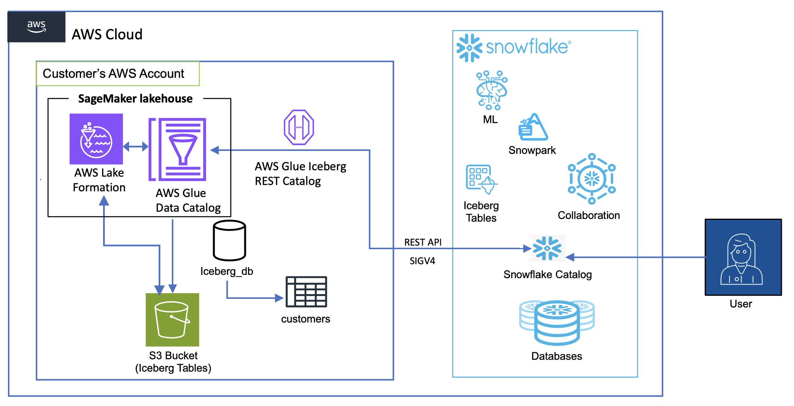

{}
⚠️ **Lưu ý:** Các thông tin dưới đây chỉ nhằm mục đích tham khảo, vui lòng **không sao chép nguyên văn** cho bài báo cáo của bạn kể cả warning này.
{}

# Phá vỡ các silo dữ liệu và truy vấn liền mạch các bảng Iceberg trong Amazon SageMaker từ Snowflake

bởi Nidhi Gupta và Andries Engelbrecht vào ngày 15 tháng 9 năm 2025 trong Nâng [cao (300),](https://aws.amazon.com/blogs/big-data/category/learning-levels/advanced-300/) [Amazon SageMaker Lakehouse](https://aws.amazon.com/blogs/big-data/category/analytics/amazon-sagemaker-lakehouse/), [Amazon Simple Storage Service (S3),](https://aws.amazon.com/blogs/big-data/category/storage/amazon-simple-storage-services-s3/) [AWS Glue](https://aws.amazon.com/blogs/big-data/category/analytics/aws-glue/), [AWS Lake Formation](https://aws.amazon.com/blogs/big-data/category/analytics/aws-lake-formation/), [Giải pháp đối tác](https://aws.amazon.com/blogs/big-data/category/post-types/partner-solutions/), [S3 Select](https://aws.amazon.com/blogs/big-data/category/storage/s3-select/), [ Hướng dẫn kỹ thuật](https://aws.amazon.com/blogs/big-data/category/post-types/technical-how-to/) [Permalink](https://aws.amazon.com/blogs/big-data/break-down-data-silos-and-seamlessly-query-iceberg-tables-in-amazon-sagemaker-from-snowflake/)  [Chia  sẻ](https://aws.amazon.com/blogs/big-data/break-down-data-silos-and-seamlessly-query-iceberg-tables-in-amazon-sagemaker-from-snowflake/#Comments)  [nhận xét](https://aws.amazon.com/vi/blogs/big-data/break-down-data-silos-and-seamlessly-query-iceberg-tables-in-amazon-sagemaker-from-snowflake/)

Các tổ chức thường gặp khó khăn trong việc thống nhất hệ sinh thái dữ liệu của họ trên nhiều nền tảng và dịch vụ. Khả năng kết nối giữa [Amazon SageMaker](https://aws.amazon.com/sagemaker/) và [Đám mây dữ liệu AI của Snowflake](https://www.snowflake.com/en/) cung cấp một giải pháp mạnh mẽ cho thách thức này, vì vậy các doanh nghiệp có thể tận dụng thế mạnh của cả hai môi trường trong khi vẫn duy trì chiến lược dữ liệu gắn kết.

Trong bài đăng này, chúng tôi trình bày cách bạn có thể phá vỡ các silo dữ liệu và nâng cao khả năng phân tích của mình bằng cách truy vấn các bảng Apache Iceberg trong[kiến trúc lakehouse của SageMaker](https://aws.amazon.com/sagemaker/lakehouse/)trực tiếp từ Snowflake. Với khả năng này, bạn có thể truy cập và phân tích dữ liệu được lưu trữ trong[Dịch vụ lưu trữ đơn giản của Amazon](https://aws.amazon.com/s3/)(Amazon S3) đến[Danh mục dữ liệu AWS Glue](https://docs.aws.amazon.com/glue/latest/dg/catalog-and-crawler.html)sử dụng[Điểm cuối AWS Glue Iceberg REST](https://docs.aws.amazon.com/glue/latest/dg/access_catalog.html), tất cả đều được bảo mật bởi[AWS Lake Formation](https://aws.amazon.com/lake-formation/), mà không cần các quy trình trích xuất, chuyển đổi và tải (ETL) phức tạp hoặc sao chép dữ liệu. Bạn cũng có thể tự động khám phá và làm mới bảng bằng cách sử dụng[Cơ sở dữ liệu liên kết với danh mục bông tuyết cho Iceberg](https://docs.snowflake.com/en/user-guide/tables-iceberg-catalog-linked-database). Trong các phần sau, chúng tôi hướng dẫn cách thiết lập tích hợp này để người dùng Snowflake có thể truy vấn và phân tích dữ liệu được lưu trữ trong AWS một cách liền mạch, từ đó cải thiện khả năng truy cập dữ liệu, giảm dư thừa và cho phép phân tích toàn diện hơn trên toàn bộ hệ sinh thái dữ liệu của bạn.

**Các trường hợp sử dụng kinh doanh và lợi ích chính**

Khả năng truy vấn các bảng Iceberg trong SageMaker từ Snowflake mang lại giá trị đáng kể trong nhiều ngành:

·        Dịch vụ tài chính – Tăng cường phát hiện gian lận thông qua phân tích thống nhất dữ liệu giao dịch và mẫu hành vi của khách hàng

·        Chăm sóc sức khỏe \- Cải thiện kết quả của bệnh nhân thông qua quyền truy cập tích hợp vào dữ liệu lâm sàng, yêu cầu bồi thường và nghiên cứu

·        Bán lẻ – Tăng tỷ lệ giữ chân khách hàng bằng cách kết nối dữ liệu bán hàng, hàng tồn kho và hành vi của khách hàng để có trải nghiệm được cá nhân hóa

·        Sản xuất – Tăng hiệu quả sản xuất thông qua cảm biến thống nhất và phân tích dữ liệu hoạt động

·        Viễn thông – Giảm tỷ lệ khách hàng rời bỏ với phân tích toàn diện về hiệu suất mạng và dữ liệu sử dụng của khách hàng

Lợi ích chính của khả năng này bao gồm:

·        Đẩy nhanh quá trình ra quyết định – Giảm thời gian thông tin chi tiết thông qua quyền truy cập dữ liệu tích hợp trên các nền tảng

·        Tối ưu hóa chi phí – Đẩy nhanh thời gian thông tin chi tiết bằng cách truy vấn dữ liệu trực tiếp trong bộ nhớ mà không cần nhập

·        Cải thiện độ trung thực của dữ liệu – Giảm sự không nhất quán của dữ liệu bằng cách thiết lập một nguồn tin cậy duy nhất

·        Tăng cường cộng tác – Tăng năng suất đa chức năng thông qua việc chia sẻ dữ liệu đơn giản giữa các nhà khoa học dữ liệu và nhà phân tích

Bằng cách sử dụng kiến trúc lakehouse của SageMaker với sức mạnh tính toán phi máy chủ và không điều chỉnh của Snowflake, bạn có thể phá vỡ các silo dữ liệu, cho phép phân tích toàn diện và dân chủ hóa quyền truy cập dữ liệu. Tích hợp này hỗ trợ kiến trúc dữ liệu hiện đại ưu tiên tính linh hoạt, bảo mật và hiệu suất phân tích, cuối cùng thúc đẩy việc ra quyết định nhanh hơn, sáng suốt hơn trong toàn doanh nghiệp.

**Tổng quan về giải pháp**

Sơ đồ sau đây cho thấy kiến trúc để tích hợp danh mục giữa bảng Snowflake và Iceberg trong nhà hồ.

Quy trình làm việc bao gồm các thành phần sau:

·        Lưu trữ và quản lý dữ liệu:

o   Amazon S3 đóng vai trò là lớp lưu trữ chính, lưu trữ dữ liệu bảng Iceberg

o   Danh mục dữ liệu duy trì siêu dữ liệu cho các bảng này

o   Lake Formation cung cấp dịch vụ bán hàng tự động thông tin xác thực

·        Quy trình xác thực:

o   Snowflake bắt đầu truy vấn bằng cấu hình tích hợp danh mục

o   Lake Formation cung cấp thông tin xác thực tạm thời thông qua [AWS Security Token Service](https://docs.aws.amazon.com/STS/latest/APIReference/welcome.html) (AWS STS)

o   Các thông tin đăng nhập này được tự động làm mới dựa trên khoảng thời gian làm mới đã đặt cấu hình

·        Luồng truy vấn:

o   Người dùng Snowflake gửi truy vấn đối với các bảng Iceberg được gắn kết

o   Điểm cuối AWS Glue Iceberg REST xử lý các yêu cầu này

o   Thực thi truy vấn sử dụng tài nguyên điện toán của Snowflake trong khi đọc trực tiếp từ Amazon S3

o   Kết quả được trả về cho người dùng Snowflake trong khi vẫn duy trì tất cả các biện pháp kiểm soát bảo mật

Có bốn mẫu để truy vấn bảng Iceberg trong SageMaker từ Snowflake:

·        Bảng Iceberg trong vùng lưu trữ S3 sử dụng điểm cuối AWS Glue Iceberg REST và tích hợp danh mục Snowflake Iceberg REST, với dịch vụ bán thông tin xác thực từ Lake Formation

·        Bảng Iceberg trong vùng lưu trữ S3 sử dụng điểm cuối AWS Glue Iceberg REST và tích hợp danh mục Snowflake Iceberg REST, sử dụng ổ đĩa ngoài Snowflake để lưu trữ dữ liệu Amazon S3

·        Bảng Iceberg trong vùng lưu trữ S3 sử dụng tích hợp danh mục API AWS Glue, cũng sử dụng ổ đĩa ngoài Snowflake vào Amazon S3

·        [Bảng Amazon S3 sử dụng tích hợp danh mục Iceberg REST với bán thông tin xác thực](https://aws.amazon.com/blogs/storage/connect-snowflake-to-s3-tables-using-the-sagemaker-lakehouse-iceberg-rest-endpoint/) từ Lake Formation

Trong bài đăng này, chúng tôi triển khai mẫu truy cập đầu tiên trong số bốn mẫu truy cập này bằng cách sử dụng [tích hợp danh mục](https://docs.snowflake.com/en/user-guide/tables-iceberg-configure-catalog-integration-rest#sigv4-glue) cho điểm cuối AWS Glue Iceberg REST với  xác thực [Signature Phiên bản 4 (SigV4)](https://docs.aws.amazon.com/IAM/latest/UserGuide/reference_aws-signing.html) trong Snowflake.

**Điều kiện tiên quyết**

Bạn phải có các điều kiện tiên quyết sau:

·        Một [tài khoản Bông tuyết](https://signup.snowflake.com/).

·        Vai  [ trò AWS Identity and Access Management](https://aws.amazon.com/iam/) (IAM) là quản trị viên hồ dữ liệu Lake Formation trong tài khoản AWS của bạn. Quản trị viên hồ dữ liệu là người chính IAM có thể đăng ký vị trí Amazon S3, truy cập Danh mục dữ liệu, cấp quyền Lake Formation cho người dùng khác và xem [AWS CloudTrail](https://aws.amazon.com/cloudtrail). Xem Tạo [quản trị viên hồ dữ liệu](https://docs.aws.amazon.com/lake-formation/latest/dg/initial-LF-setup.html#create-data-lake-admin) để biết thêm thông tin.

·        Một  cơ sở dữ liệu [AWS Glue](https://aws.amazon.com/glue/) hiện có  có tên iceberg\_db và bảng Iceberg được đặt tên là khách hàng với dữ liệu được lưu trữ trong vùng lưu trữ đa năng S3 với một tên duy nhất. Để tạo bảng, hãy tham khảo [lược đồ](https://github.com/gregrahn/tpch-kit/blob/master/dbgen/dss.ddl) và [tập dữ liệu](https://github.com/gregrahn/tpch-kit/blob/master/ref_data/1/customer.tbl.1) bảng.

·        Vai trò IAM do người dùng xác định mà Lake Formation đảm nhận khi truy cập dữ liệu ở vị trí S3 nói trên để cung cấp thông tin xác thực có phạm vi (xem Yêu [cầu đối với vai trò được sử dụng để đăng ký vị trí](https://docs.aws.amazon.com/lake-formation/latest/dg/registration-role.html)). Đối với bài đăng này, chúng tôi sử dụng vai trò IAM LakeFormationLocationRegistrationRole.

Giải pháp mất khoảng 30–45 phút để thiết lập. Chi phí thay đổi dựa trên khối lượng dữ liệu và tần suất truy vấn. Sử dụng [Công cụ tính giá AWS](https://calculator.aws/#/) để biết các ước tính cụ thể.

**Tạo vai trò IAM cho Snowflake**

Để tạo vai trò IAM cho Snowflake, trước tiên bạn tạo một chính sách cho vai trò:

1\. 	Trên bảng điều khiển IAM, chọn Chính sách trong ngăn điều hướng.

2\. 	Chọn Tạo chính sách.

3\. 	Chọn trình chỉnh sửa JSON và nhập chính sách sau (cung cấp Khu vực AWS và ID tài khoản của bạn), sau đó chọn Tiếp theo.

{

     "Version": "2012-10-17",

     "Statement": \[

         {

         	"Sid": "AllowGlueCatalogTableAccess",

         	"Effect": "Allow",

         	"Action": \[

             	"glue:GetCatalog",

             	"glue:GetCatalogs",

                 "glue:GetPartitions",

             	"glue:GetPartition",

             	"glue:GetDatabase",

             	"glue:GetDatabases",

             	"glue:GetTable",

             	"glue:GetTables",

             	"glue:UpdateTable"

         	\],

         	"Resource": \[

                 "arn:aws:glue:\<region\>:\<account-id\>:catalog",

                 "arn:aws:glue:\<region\>:\<account-id\>:database/iceberg\_db",

                 "arn:aws:glue:\<region\>:\<account-id\>:table/iceberg\_db/\*",

         	\]

         },

         {

         	"Effect": "Allow",

         	"Action": \[

                 "lakeformation:GetDataAccess"

         	\],

         	"Resource": "\*"

         }

4\. 	Nhập iceberg-table-access làm tên chính sách.

5\. 	Chọn Tạo chính sách.

Bây giờ bạn có thể tạo vai trò và đính kèm chính sách bạn đã tạo.

6\. 	Chọn Vai trò trong ngăn điều hướng.

7\. 	Chọn Tạo vai trò.

8\. 	Chọn tài khoản AWS.

9\. 	Trong Tùy chọn, chọn Yêu cầu ID bên ngoài và nhập ID bên ngoài mà bạn chọn.

10\. Chọn Tiếp theo.

11\. Chọn chính sách bạn đã tạo (chính sách iceberg-table-access).

12\. Nhập snowflake\_access\_role làm tên vai trò.

13\. Chọn Tạo vai trò.

**Định cấu hình kiểm soát truy cập Lake Formation**

Để định cấu hình kiểm soát truy cập Lake Formation của bạn, trước tiên hãy thiết lập tích hợp ứng dụng:

1\. 	Đăng nhập vào bảng điều khiển Lake Formation với tư cách quản trị viên hồ dữ liệu.

2\. 	Chọn Quản trị trong ngăn điều hướng.

3\. 	Chọn Cài đặt tích hợp ứng dụng.

4\. 	Bật Cho phép công cụ bên ngoài truy cập dữ liệu trong các vị trí Amazon S3 với quyền truy cập bảng đầy đủ.

5\. 	Chọn Lưu.

Giờ đây, bạn có thể cấp quyền cho vai trò IAM.

6\. 	Chọn Quyền dữ liệu trong ngăn điều hướng.

7\. 	Chọn Grant.

8\. 	Định cấu hình các cài đặt sau:

a. 	Đối với Hiệu trưởng, chọn Người dùng và vai trò IAM rồi chọn snowflake\_access\_role.

b.	Đối với Tài nguyên, hãy chọn Tài nguyên Danh mục dữ liệu được đặt tên.

c. 	Đối với Danh mục, hãy chọn ID tài khoản AWS của bạn.

d.	Đối với Cơ sở dữ liệu, chọn iceberg\_db.

e. 	Đối với Bảng, chọn customer.

f.  	Đối với Quyền, hãy chọn SUPER.

9\. 	Chọn Grant.

Cần có quyền truy cập SUPER để gắn bảng Iceberg trong Amazon S3 dưới dạng bảng Bông tuyết.

**Đăng ký vị trí hồ dữ liệu S3**

Hoàn thành các bước sau để đăng ký vị trí hồ dữ liệu S3:

1\. 	Với tư cách là quản trị viên hồ dữ liệu trên bảng điều khiển Lake Formation, hãy chọn Vị trí hồ dữ liệu trong ngăn điều hướng.

2\. 	Chọn Đăng ký địa điểm.

3\. 	Định cấu hình như sau:

a. 	Đối với đường dẫn S3, hãy nhập đường dẫn S3 đến vùng lưu trữ nơi bạn sẽ lưu trữ dữ liệu của mình.

b.	Đối với vai trò IAM, hãy chọn LakeFormationLocationRegistrationRole.

c. 	Đối với Chế độ Quyền, chọn Thành tạo hồ.

4\. 	Chọn Đăng ký địa điểm.

**Thiết lập tích hợp Iceberg REST trong Snowflake**

Hoàn thành các bước sau để thiết lập tích hợp Iceberg REST trong Snowflake:

1\. 	Đăng nhập vào Snowflake với tư cách là người dùng quản trị.

2\. 	Thực hiện lệnh SQL sau (cung cấp Khu vực, ID tài khoản và ID bên ngoài mà bạn đã cung cấp trong quá trình tạo vai trò IAM):

CREATE OR REPLACE CATALOG INTEGRATION glue\_irc\_catalog\_int

CATALOG\_SOURCE \= ICEBERG\_REST

TABLE\_FORMAT \= ICEBERG

CATALOG\_NAMESPACE \= 'iceberg\_db'

REST\_CONFIG \= (

    CATALOG\_URI \= 'https://glue.\<region\>.amazonaws.com/iceberg'

    CATALOG\_API\_TYPE \= AWS\_GLUE

    CATALOG\_NAME \= '\<account-id\>'

    ACCESS\_DELEGATION\_MODE \= VENDED\_CREDENTIALS

)

REST\_AUTHENTICATION \= (

	TYPE \= SIGV4

    SIGV4\_IAM\_ROLE \= 'arn:aws:iam::\<account-id\>:role/snowflake\_access\_role'

    SIGV4\_SIGNING\_REGION \= '\<region\>'

    SIGV4\_EXTERNAL\_ID \= '\<external-id\>'

)

REFRESH\_INTERVAL\_SECONDS \= 120

ENABLED \= TRUE;

3\. 	Thực hiện lệnh SQL sau và truy xuất giá trị cho API\_AWS\_IAM\_USER\_ARN:

MÔ TẢ glue\_irc\_catalog\_int TÍCH HỢP DANH MỤC;

4\. 	Trên bảng điều khiển IAM, hãy cập nhật mối quan hệ tin cậy cho snowflake\_access\_role với giá trị cho API\_AWS\_IAM\_USER\_ARN:

{

    "Version": "2012-10-17",

    "Statement": \[

        {

            "Sid": "",

	        "Effect": "Allow",

            "Principal": {

            	"AWS": \[

                   "\<API\_AWS\_IAM\_USER\_ARN\>"

            	\]

            },

            "Action": "sts:AssumeRole",

            "Condition": {

            	"StringEquals": {

                	"sts:ExternalId": \[

                        "\<external-id\>"

                	\]

            	}

            }

        }

    \]

}

5\. 	Xác minh việc tích hợp danh mục:

SELECT SYSTEM$VERIFY\_CATALOG\_INTEGRATION('glue\_irc\_catalog\_int');

6\. 	Gắn bảng S3 làm bàn Bông tuyết:

CREATE OR REPLACE ICEBERG TABLE s3iceberg\_customer

CATALOG \= 'glue\_irc\_catalog\_int'

CATALOG\_NAMESPACE \= 'iceberg\_db'

CATALOG\_TABLE\_NAME \= 'customer'

AUTO\_REFRESH \= TRUE;

**Truy vấn bảng Iceberg từ Snowflake**

Để kiểm tra cấu hình, hãy đăng nhập vào Snowflake với tư cách là người dùng quản trị và chạy truy vấn mẫu sau: CHỌN \* TỪ s3iceberg\_customer GIỚI HẠN 10;

**Quét dọn**

Để dọn dẹp tài nguyên của bạn, hãy hoàn thành các bước sau:

1\. 	Xóa cơ sở dữ liệu và bảng trong AWS Glue.

2\. 	Thả bảng Iceberg, tích hợp danh mục và cơ sở dữ liệu trong Snowflake:

DROP ICEBERG TABLE iceberg\_customer;

DROP CATALOG INTEGRATION glue\_irc\_catalog\_int;

Đảm bảo rằng tất cả các tài nguyên được dọn dẹp đúng cách để tránh các khoản phí không mong muốn.

**Kết thúc**

Trong bài đăng này, chúng tôi đã trình bày cách thiết lập kết nối an toàn và hiệu quả giữa môi trường Snowflake của bạn và SageMaker để truy vấn các bảng Iceberg trong Amazon S3. Khả năng này có thể giúp tổ chức của bạn duy trì một nguồn tin cậy duy nhất đồng thời cho phép các nhóm sử dụng các công cụ phân tích ưa thích của họ, cuối cùng phá vỡ các silo dữ liệu và nâng cao khả năng phân tích cộng tác.

Để khám phá thêm và triển khai giải pháp này trong môi trường của bạn, hãy xem xét các tài nguyên sau:

·        Tài liệu kỹ thuật:

o   Xem lại [Hướng dẫn sử dụng Amazon SageMaker Lakehouse](https://docs.aws.amazon.com/sagemaker-unified-studio/latest/userguide/lakehouse.html)

o   Khám phá [Bảo mật trong AWS Lake Formation](https://docs.aws.amazon.com/lake-formation/latest/dg/security.html) để biết các biện pháp thực hành tốt nhất nhằm tối ưu hóa các biện pháp kiểm soát bảo mật của bạn

o   Tìm hiểu thêm về [định dạng bảng Iceberg](https://iceberg.apache.org/) và lợi ích của nó đối với hồ dữ liệu

o   Tham khảo Cấu [hình truy cập an toàn từ Snowflake sang Amazon S3](https://docs.snowflake.com/en/user-guide/data-load-s3-config)

·        Các bài đăng trên blog liên quan:

o   [Xây dựng hồ dữ liệu theo thời gian thực với Bảng Snowflake và Amazon S3](https://aws.amazon.com/blogs/apn/build-real-time-data-lakes-with-snowflake-and-amazon-s3-tables/)

o   [Đơn giản hóa quyền truy cập dữ liệu cho doanh nghiệp của bạn bằng cách sử dụng Amazon SageMaker Lakehouse](https://aws.amazon.com/blogs/big-data/simplify-data-access-for-your-enterprise-using-amazon-sagemaker-lakehouse/)

Những tài nguyên này có thể giúp bạn triển khai và tối ưu hóa mẫu tích hợp này cho trường hợp sử dụng cụ thể của bạn. Khi bạn bắt đầu hành trình này, hãy nhớ bắt đầu từ quy mô nhỏ, xác thực kiến trúc của bạn với dữ liệu thử nghiệm và dần dần mở rộng quy mô triển khai dựa trên nhu cầu của tổ chức bạn.

**Về các tác giả**

### 

### 

### 

### 

### Nidhi Gupta

[Nidhi](https://www.linkedin.com/in/nidhi-gupta-5b80874/) là Kiến trúc sư Giải pháp Đối tác Cấp cao tại AWS, chuyên về dữ liệu và phân tích. Cô hỗ trợ khách hàng và đối tác xây dựng và tối ưu hóa các khối công việc Snowflake trên AWS. Nidhi có nhiều kinh nghiệm trong việc dẫn dắt các lần phát hành và triển khai sản phẩm, với trọng tâm về Dữ liệu, Trí tuệ nhân tạo (AI), Học máy (ML), Trí tuệ nhân tạo tạo sinh (Generative AI), và Phân tích nâng cao (Advanced Analytics).

### Andries Engelbrecht

[Andries](https://www.linkedin.com/in/andries-engelbrecht-427b8b1/) là Kỹ sư Giải pháp Đối tác Cấp cao tại Snowflake, làm việc cùng AWS. Anh hỗ trợ việc tích hợp sản phẩm và dịch vụ, cũng như phát triển các giải pháp chung với AWS. Andries có hơn 25 năm kinh nghiệm trong lĩnh vực dữ liệu và phân tích.

